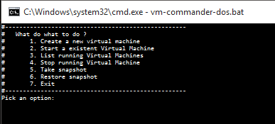
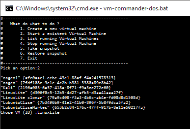

# DS-2017-Fall
Homeworks for DS-2017-Fall (Univalle)

#Homework 1
Simple Bash script for Virtual Machine creation and more
+ MS-DOS Version using VBoxManage
https://github.com/AndresHerrera/DS-2017-Fall/tree/master/HW1

  
  

